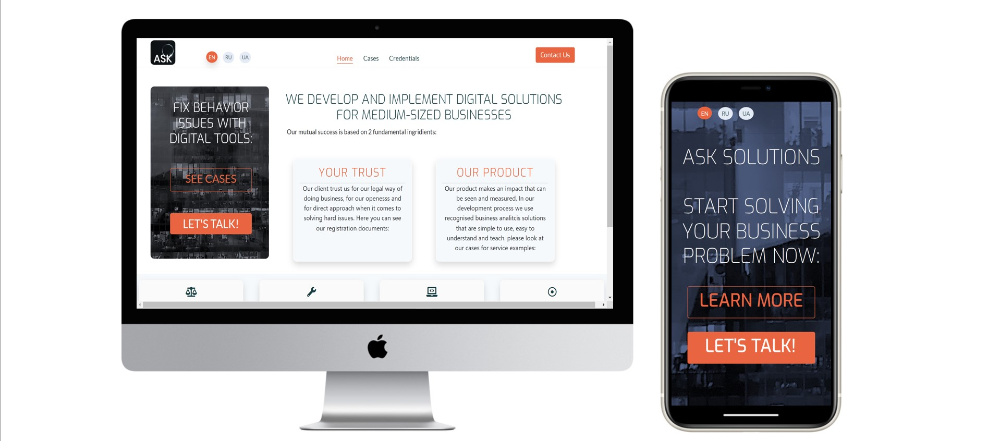
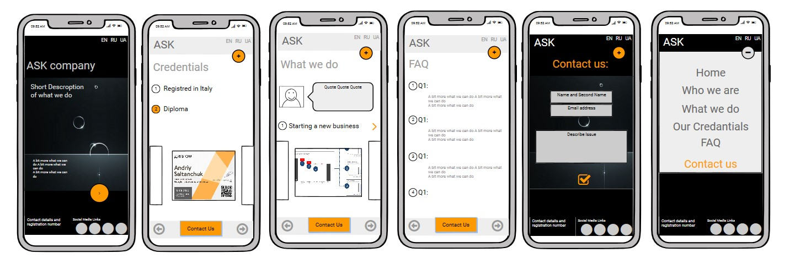
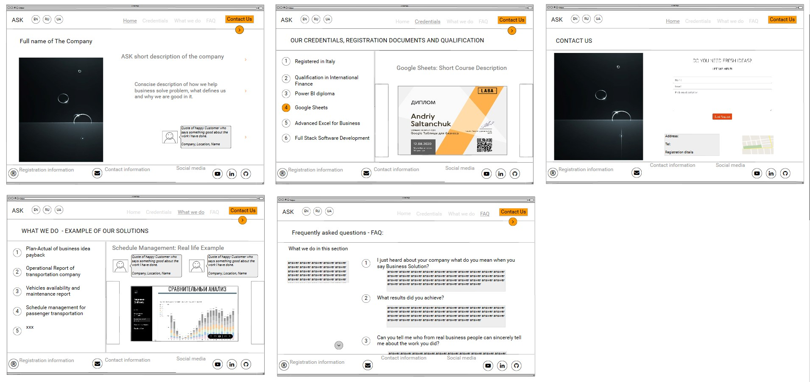
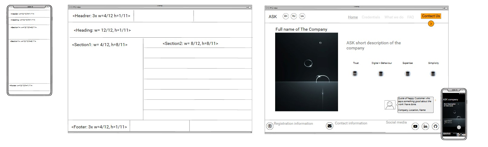
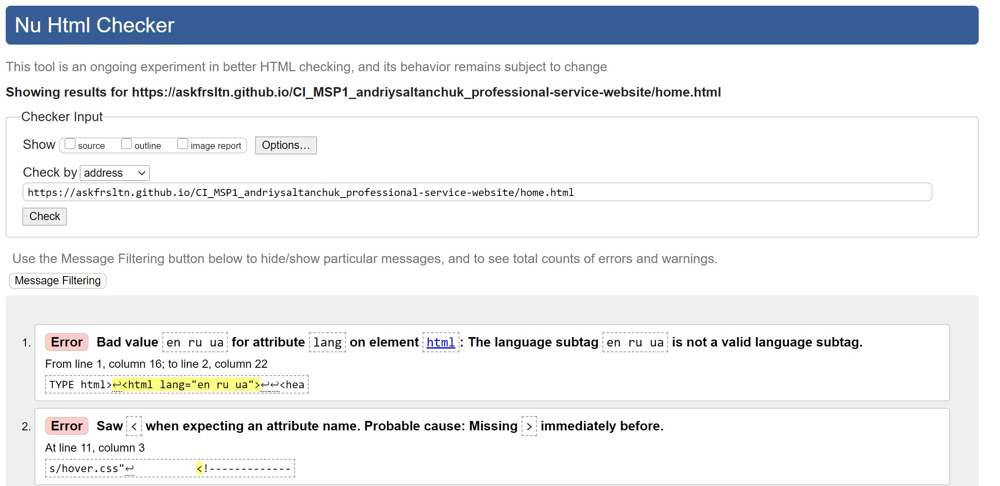
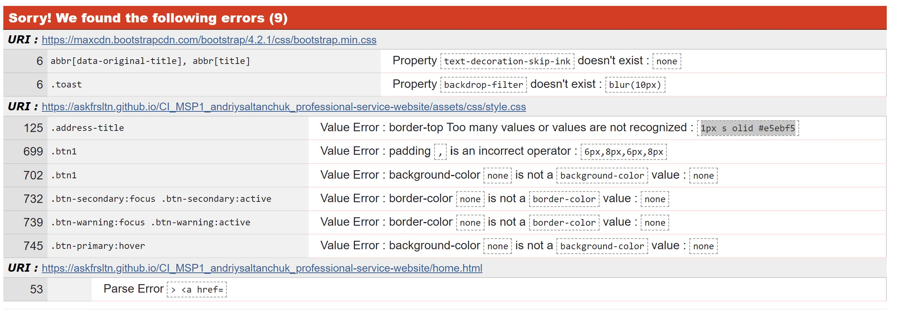
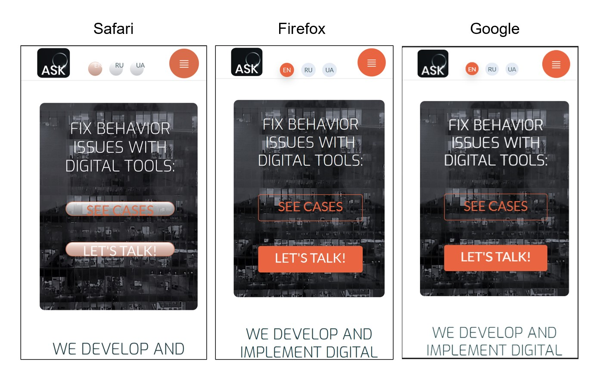

# WELCOME TO "ASK FOR SOLUTION" CONSULTING COMPANY WEBSITE

* The purpose of the web-site is twofold - (1) promote consulting services of a real company "ASK SOLUTIONS" to potential client 
and (2) convince the client to make a first contact with the compnay. 
* The link to the website: [ASK SOLUTIONS](https://askfrsltn.github.io/CI_MSP1_andriysaltanchuk_professional-service-website]
* It is important to understand who the user is before developping a website. Potential client is a mid size company owner 
who speaks Russian, English or Ukrainian language. S/he struggles with some business managemnt issue and considers an advise 
from external expert in the field of finance and business management. Maybe it is a first time he considers that. He has a vague idea what he needs
However he knows that one of the digital tools such as Power BI, Google data studio and excell can be a part of his solution.

## **USER EXPERIENCEF**
### 1. Before visit
The client decides to visit the site most probabley follows recommmendation of someone who recommended him the company. 
So he visits the domain www.ask-for-solution.com. A potential client wants to see answers to fundamental simple questions:
1. Is it worth dealing with this company?
2. What does this company do?
3. Can the company help him?
4. How exactly the company help him?
5. Reasons for the client to believe the company?
Bases on the onformation on the site he will decide to deal witht this company or not.

### 2. First Visit
* The landing page gives a user a positive answer to the very first question: yes this company has a site, it looks simple, professional and it seems like they really solve some issues.
* After landing on a page the client can quickly decide 2 things: (1) What language he wants to read the information on. (2) what he wants to do now - contact the company immidiately or learn a bit more about it. 
* The landing page automatically suggests to press "let's talk" button and proceed to contact page with the simple 3 lines contact form.
* The "learn more" button redirect the client to a "home" page which has more information on it. 
* On the home page there is a second call-out suggesting the user to look at the examples or press the button "Let's talk" again. 
* If the user decides to read more, he read the title explaining that the company develop digital solutions for the business adn scroll down (on a mobile) or read next to the right.
* After a first title he finds detailed information about service succcess- the user sees that his trust and compnay product effectievness is a key to success. 
* At this point the client may want to decide to look at more details about this success factors, so he can press one of the cards and go to 1 of 2 pages:
    - "Trust" card redirects him to credential page - simple page with image gallery. Here the client can press and chack that registration and qualification of the company is adequate and client can trust the company.
    - "Products" card redirect him to "cases" page- the page where he can see 3  examples of the work the company did and some details that will convince the client that this exmples are clos to his business (results that the client achieved, actions and quote from the customer of the real companies)
* Still on a home page if the client decides what exactly make this company unique he can find 4 more boxes explaingn that company believes in legal way of doing things, it  product is simple enough to learn and use.
* If any moment the client decides to leave the page he sees the navigation bar at the top-center of desktop screen or he sees large orange burger button if he uses mobile, this menu helps him navigate the site from any page to any page (apart from landing).
* On the footer of any page (desktop) the user can see registartion numbers that tells him that business is legal, official address of the company and 3 social media icons if he wants to know public infomration about company on linkedin, github or youtube channel.
* Mobile version of the footer is more simple, it has a red contact button to remind the user that he may contact the company immideatly and social media icons.
* Languages can be changed at any moment of site navigation through 3 icons at the header. Currently Russian and Ukrainian languages are under construction. If the user presses UA or RU icon in the header he can see a modal popupexplaining that this pages are under construction. The modal will be deleted after pages in other languages will be built.
* COntact page has 2 sectios: address with googe map and a soimple 3-lines contact form.

## **APPROACH**

In developping wireframes I was guided by foloowing principles:
1. User experience should be intuitive therefore the site structure and experience should be intuitive, simple and usefull.
2. Following 5 UXD planes guidelines to define strategy, scope, structure and skeleton of the website I defined user goals, my goals, listed priority questions and built my first version of wireframes.
3. I applied a "mobile first" approach. 
4. I was trying to avoid ecsessive content focusing more on user need to make decision as quickly as possible.
5. using Balsamique I developped 5 pages website for mobile (picture 1), then desktop versions of it (figure 2), after that I developed css layout (figure 3): 
6. I discussed the wireframes with mentor and started to list features and elements I wanted to use in Surface plane of UXD.

#### picture 1: Mobile pages in Balsamique

#### picture 2: Desktop pages in Balsamique

#### picture 3: pages grid layout in Balsamique for mobile and Desktop

## **FEATURES**

In this section I will list all the features I used at the website and I will try to explain why I chose them functionally and from design perspective.

1. **Images**
    > - Most of the images I used belong to me. hero-Image, documents on a credentials page etc
    > - Logo images for clients quotes are provided by my partners. British Petroleum image was found in internet. 
2. **Fonts**
    > I used 2 types of fonts: Exo for titles and Late for small text.
3. **Colors**
    >I used 3 major colors: 
    >- Red-Carrot - #E96541 to highlight buttons and important text
    >- Dark-olive - #183f45 for regular text and titles
    >- Light grey - #D9DEDF, to dim certain unimportant text that needs to be on a page however it is not that important
    >- Some other light grey colors were used form time to time for background and to create a contrast  with cards etc.

4. **Icons**
    > Fontawesome is a good resource for majority of Icons on a website, 
    > I also used a Bootstrap icon for mobile version dropdown menu 
5. Bootstrap layout tools
    >- Grid - to ensure respnsiveness between desktop and mobile screen standard sizes
    >- Flexbox was used in some cases to distribute components inside container (e.g. footer or Social media icons)
6. Modals
    >I used modal to show a message for those languages that are still in development (RU and UA). There is a fantastic [video on youtube by Max from Academind](https://youtu.be/N3RK2dZpQXs?t=727 "How to create modal in CSS") that helped me very simple and easy to follow.
7. **Image Gallery (carousel)**
    >Following great recommendation of my mentor Ignatius I used [Fancybox](https://fancyapps.com/fancybox/3/docs/ "Great tool of working with images in CSS") to create an image carousel and allign images on my credentials page, I edited it to make it work with documents sizes.
8. **Buttons**
    >I created buttons myself and used Bootstrap buttons source. I edited them a lot therefore ran in different challenges with codes.
    >I used :hover to make simple animations with icons, fonts, background colors and borders.
9. **Cards**
    >I used 2 types of cards:
    >-Bootstrap accordion for my "cases" page. It really nicely groups content into separate theme sections on the page
    >-Because Bootstrap took me a lot of time I made some buttons myself such as navigation buttons, social media and cards buttons on a home page.
10. **Map and Iframe**
    >Google code for the map was used on a contact page to show where exactly the company is located. 
11. Form
    >Standard 3 line form was used from love-running project. I thought its simplicity and functionality meets functional and design requirement in full. I changed the button color to match the standard I use across the site.

## **FEATURES STILL TO IMPLEMENT**
There are few elements and components I plan to implement after I submit the project:
1. **Languages** - I want to translate the site in Russian and Ukrainin language because it will be used for russian, ukrainian speaking client.
2. **Links to live digital tools** - I have few business analytics tools that I developped, they are currently online but I want to sanitise them before I can link to it. They have sensitive information.
3. **Video Content** - i plan to open Youtube channel and embed my short video content onto website home page below "4 aspects of work" section. Maybe I will move it up the content as more priority section.

## **TECHNOLOGIES**
In this section I will list programing languages, development tools, framworks, libraries and programs

### **1. Languages**
* **HTML5** - basic front-end language for web structure
* **CSS3** - for styling html including Grid, Flexbox to develop responsive layout
* JavaScript embedded into bootstrap solutions sucha as buttons, carousels and cards animation.

### **2. Developmet Tools**
* **Google DevTools** - Googleinspect and Firefox inspect to address bugs and fix responsiveness misalignments
* **Fancyapp/Fancybox** - to use carousel and align images on my credentials page.

### **3. Frameworks,Libraries and Programs**
* **Balsamiq**: to create the wireframes during the design process
* **Bootstrap 4.4.1**: to assist with the responsiveness and styling of the website.
* **Hover.css**: for Social Media icons in the footer to add the float transition while being hovered over.
* **Google Fonts**: Google fonts were used to import the 'Exo' 'Roboto' and "Lato' font into the style.css file which is used on all pages throughout the project.
* **Font Awesome**: Font Awesome was used on all pages throughout the website to add icons for aesthetic and UX purposes.
* **jQuery**: for smooth scroll function in JavaScript and for Flexbox carousel.
* **Git**: for version control by utilizing the Gitpod terminal to commit to Git and Push to GitHub.
* **GitHub**: to store the projects code after being pushed from Git.

### **4.Other sources of Design Inspiration**
1. [AWWARDS](https://www.awwwards.com/) - benchmark for websites of different purposes
2. [Minasi](https://minasi.eu/) - simple yet effective business website focused on medium business
3. [ITIHI](https://iti.ca/en/contact/#form)  company website, great concept and few color ideas that I borrowed.
4. [Coursera](https://www.coursera.org/completed) - for accordion solution hint for cases page (changed afterwards though)
5. [Dashlane](https://www.dashlane.com/) add on the facebook for colors combination (dark olive color) 
6. [LABA](https://l-a-b-a.com/) - my banchmark for layout simplicity 
7. [Best Modern & Contemporary Thin & Extra Light Fonts](https://www.colourmylearning.com/2018/01/best-modern-contemporary-thin-extra-light-fonts/) to make decision on font selection
8. Numerous Problem solving sources:
    - [Deploying](https://www.codecademy.com/articles/f1-u3-github-pages)
    - [Grid](https://www.youtube.com/watch?v=qmPmwdshCMw&ab_channel=Academind)
    - [Linking Image](https://stackoverflow.com/questions/42793292/how-to-load-image-and-other-assets-in-angular-an-project)
    - [3 step responsiveness article](https://www.webdesignersacademy.com/show-and-hide-different-content-on-mobile-devices-desktops/#universal)
    - [README file](https://www.markdownguide.org/basic-syntax/) - Thanks to my mentor Ignatius
    - [keep the footer at the bottom](https://dev.to/domysee/keeping-the-footer-at-the-bottom-with-css-flexbox-5h5f) - Thanks to my mentor Ignatius
    - and hundreds of other cases from [Stack overflow](https://stackoverflow.com/)

## **TESTING**
I tested the site using (1)) W3C html validator, (2)Jigsaw CSS validator, tested navigation using Google Firefox and Safari browsers (3). 
I also asked my friends to test user experience online (4)
Here are the results:

### **1. HTML W3C validator**
I had 77 errors and warnings to fix. I fixed most of them however I left some of them unsolved on purpose, 
e.g main tag inside article structure was used to keep the footer at the bootom following the recommendation from [Dominik Weber](https://dev.to/domysee/keeping-the-footer-at-the-bottom-with-css-flexbox-5h5f)

**Picture 4: V3C html5 validation process**

### **2. Jigsaw CSS validator**
I ran a Jigsaw test and had 9 problems to fix. 
They were minor problems and did not have significant impact on stylling. 7 of them I fixed. 2 related to bootstrap I was not able to find.

**Picture 4: V3C CSS3 validation process**

### **3. Browsers Devtool (Inspect) testing**

From the 3 browsers that were used to test the site (Chrome, Firefox, Safari) Safari browser was the only one 
that showed different result. Landing page call-out buttons and language icons were distorted. 
I tried to fix this bug in verious ways but it did not work. 
I discussed this issue with my mentor he recommended the fix that also did not work (adding -webkit- prefix to border-radius attribute of buttons).
Finally I just used bootstrap predefined button class "btn-outline-light" edited it to my colors and it seemd to work.

**Picture 5: Browser testing**

### **4. Friends' feedback**
2 of my friends tested the site on mobile phones (iPhone 11 and Iphone SE). 
They did not have any developer background and did not notice any margin misalignments or poor functioning.
They said it is intuitive. The colors are ok. The call out page on the home page a bit irritating because it screams to them.
They did not get the meaning of the image but that was not that important afterall. 
But it did not distract them. They liked the carousel with credentials and cases. 
They recommended to put the contact form on top of the contact page followed with address and map, which I did.

## **DEPLOYMENT**
I deployed the site through gitpod and github.
I foloowed the steps:
1. Gitpod: git add .
2. Gitpod: git commit -m "message"
3. Gitpod: git push
4. Github: selected repository: "CI_MSP1_andriysaltanchuk_professional-service-website" 
5. Github: grey menu selected tab "Settings"
6. Github: Scrolled down to "Github Pages", from dropdown menu section selected "branch: master" 
7. GIthub: Press Save button.
the link to repository on a github: 

## **CREDITS**

### **1.Content**

I wrote all the content myself based on my experience

### **2.Media**

* Most pf the pictures I did myself including hero image and credentials documents.
* logo image was taken from free wallpaper soource: https://wallpaper-house.com/wallpaper-id-30670.php 
* BP logo was taken from the web
* my clients logo for cases were provided by Rim-Tours (Rome) owner and B-Elite (Ukraine) owner, 
both gave me permissions to use their image.

### **3.Aknowledgement**
* I want to thank Code Institute for great couurse materials of HTML, CSS and UCFED materials  that prepared me to the project
* I want to thank my mentor Ignatius Ukwuoma for:
1. __Intro meeting__: clear schedule that helped me to understand how to progress towards MS1.
2. __1st MSP1 Meeting__ (23-Sep-2020): Pointion out my potential UIX weaknesses while during Wireframes review, giving very specific advices how to cope with the challenges that I highlighted, giving me links to great sources that helped me to compensate some gaps in my skillset.
3. __Mid-review__ MS1P meeting: (30-sep-2020): openly poinitng that I am 60% of the pogress vs 90% expected, 
for his positive feedback about mobile version. Recommmendations to change desktop UXD 
and 25 improvement recommendations.
4. __End of Project Review__ (6th of October) and his 23 minorrecommendations for improvement

* Special thanks go to my family - my brother my wife, my litle son Luka and his younger sister Mia  who supported and motivated me in my journey towards my first developer project.
